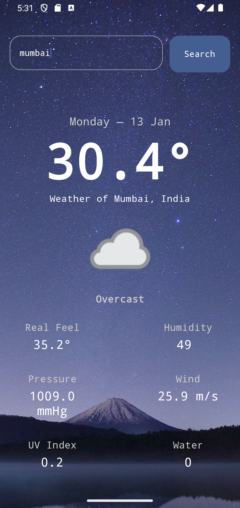
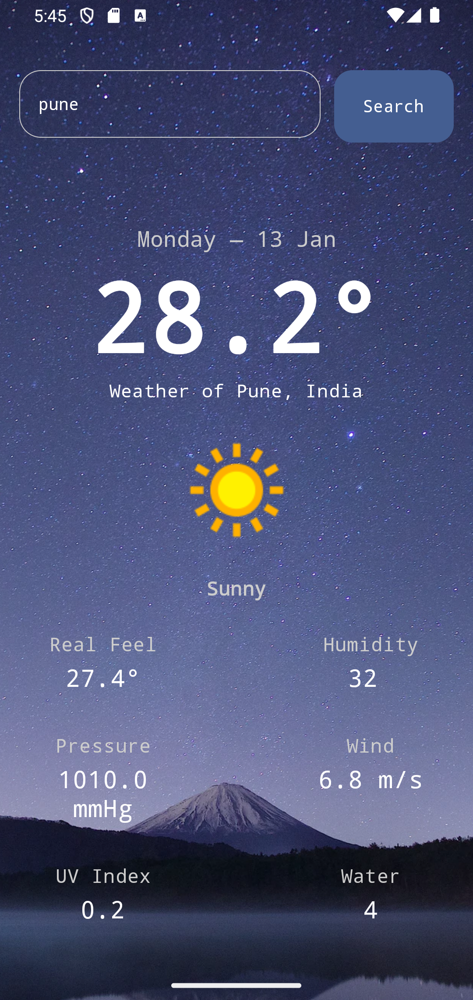
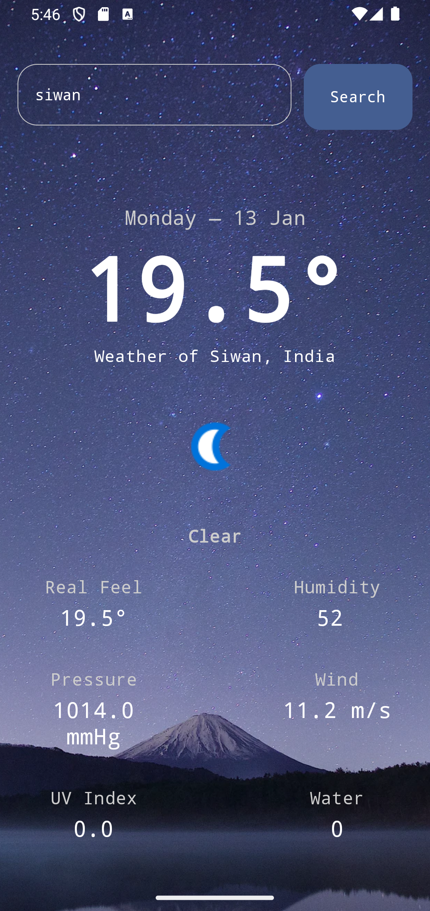

# Live Weather App

A sleek and modern **Live Weather App** built using **Android Jetpack Compose**. This app provides real-time weather updates for your location and offers features like temperature, humidity, and wind speed insights, all wrapped in an intuitive and dynamic UI.

## Features

- **Real-Time Weather Updates**: Get live weather data for your current location.
- **Dynamic UI**: Experience a modern and adaptive user interface powered by Jetpack Compose.
- **Multiple Weather Metrics**: View temperature, humidity, wind speed, and more.
- **Search Locations**: Search and view weather updates for any city worldwide.
- **Day/Night Mode**: Automatic switching of themes based on the time of day.

## Tech Stack

- **Programming Language**: Kotlin
- **UI Framework**: Jetpack Compose
- **API**: OpenWeatherMap API (or any weather API of your choice)
- **Architecture**: MVVM (Model-View-ViewModel)
- **Libraries Used**:
  - Retrofit: For API calls
  - Hilt: For Dependency Injection
  - Coroutines: For asynchronous operations
  - Coil: For loading weather-related images

## Screenshots

| Current Weather  | Search City | Detailed Weather |
|------------------|-------------|-------------------|
|  |  |  |

## Installation

1. Clone the repository:
   ```bash
   git clone https://github.com/dharmendra841434/Android-weather-app.git
   ```

2. Open the project in Android Studio.

3. Add your weatherapi API key:
   - Go to `WeatherViewModal` file of your project.
   - Add the following line:
     ```properties
     change api key with yours
     ```

4. Build and run the project on an emulator or physical device.

## Usage

1. Grant location permissions when prompted to allow the app to fetch your current location's weather.
2. Use the search bar to find weather updates for any city.
3. Swipe down to refresh weather data manually.

## Contributing

Contributions are welcome! If you have ideas for new features or improvements:

1. Fork the repository.
2. Create a new branch for your feature.
   ```bash
   git checkout -b feature-name
   ```
3. Commit your changes.
   ```bash
   git commit -m "Add your message here"
   ```
4. Push your branch and submit a pull request.

## License

This project is licensed under the MIT License. See the `LICENSE` file for more details.

---

Happy Coding! If you enjoyed using this app or found it useful, please give it a ⭐ on GitHub.

